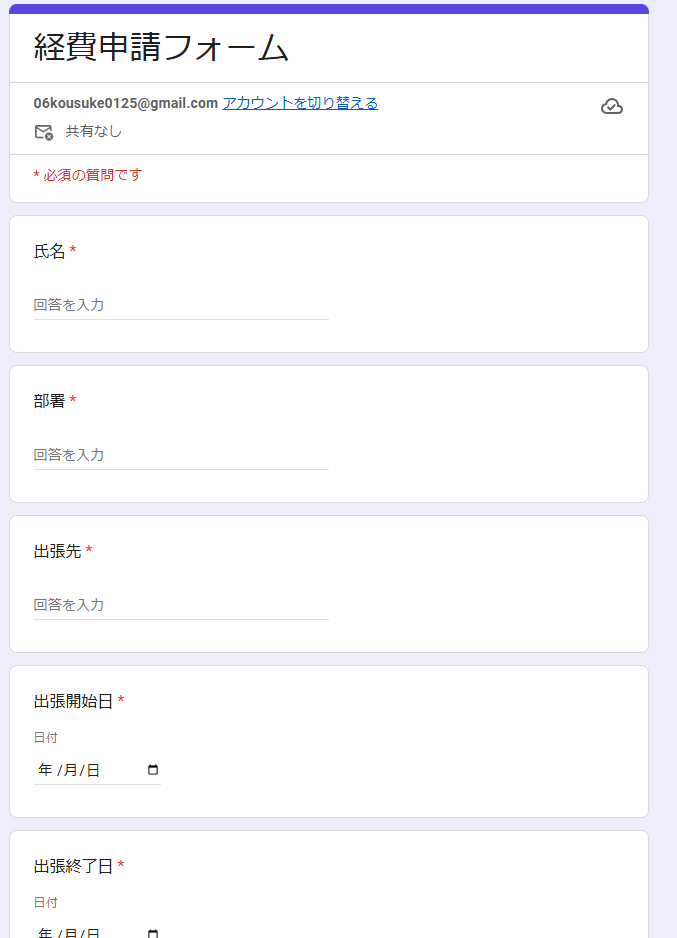
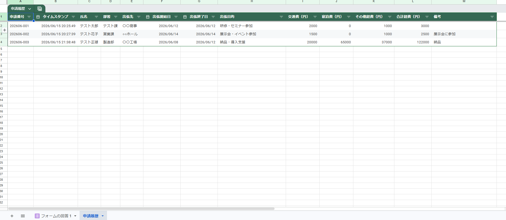
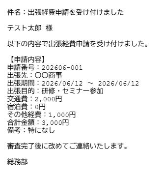
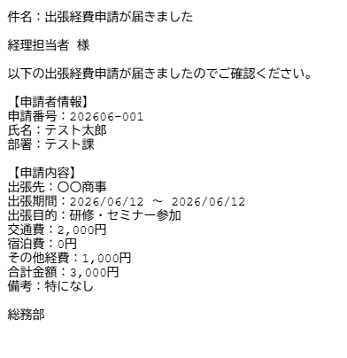

# GAS業務自動化ポートフォリオ②｜Googleフォーム連携・経費申請自動化システム

## 概要
Google Apps Script（GAS）を使用して、Googleフォームからの出張経費申請を
自動で処理するシステムです。フォーム送信をトリガーに、申請履歴への自動追記、
合計金額の自動計算、申請番号の自動採番、メール文面の自動生成までを一貫して自動化します。

## できること
- Googleフォームの送信をトリガーに自動で処理を実行
- 交通費・宿泊費・その他経費から合計金額を自動計算
- 年月+連番形式（例：202606-001）で申請番号を自動採番
- 申請履歴シートへの自動追記（テーブル形式でフィルター機能付き）
- 申請者への受付確認・経理担当者への申請通知を自動生成

## 使用技術
- Google Apps Script
- Google フォーム
- Google スプレッドシート
- Google ドライブ

## 動作イメージ
### ①Googleフォームの入力画面

### ②申請履歴シート（合計金額・申請番号自動追記）

### ③申請者への受付確認テキスト

### ④経理担当者への申請通知テキスト

## セットアップ手順
1. GoogleドライブにGAS用フォルダを作成
2. フォルダ内にGoogleフォームを新規作成し以下の項目を追加
   - 氏名（短文・必須）
   - 部署（短文・必須）
   - 出張先（短文・必須）
   - 出張開始日（日付・必須）
   - 出張終了日（日付・必須）
   - 出張目的（選択肢・必須）
   - 交通費（円）（短文・数値・必須）
   - 宿泊費（円）（短文・数値・必須）
   - その他経費（円）（短文・数値・必須）
   - 備考（短文・任意）
3. フォームの「回答」タブからスプレッドシートと連携
4. スプレッドシートに「申請履歴」シートを作成し1行目に以下のヘッダーを入力
   `申請番号│タイムスタンプ│氏名│部署│出張先│出張開始日│出張終了日│出張目的│交通費（円）│宿泊費（円）│その他経費（円）│合計金額（円）│備考`
5. フォルダ内に「メール」フォルダを作成
6. スプレッドシートの「拡張機能」→「Apps Script」を開く
7. 「コード.gs」のコードをすべてコピー&ペースト
8. トリガーを設定
   - 実行する関数：onFormSubmit
   - イベントのソース：スプレッドシートから
   - イベントの種類：フォーム送信時

## 工夫した点
- ヘッダー名で列を動的に検索するため列順が変わっても正常に動作します
- 月が変わると採番が自動でリセットされます（例：202606-001→202607-001）
- メールフォルダが存在しない場合は自動で作成します
- 動的なヘッダー検索により項目の追加・変更にも柔軟に対応できます

## 今後追加予定の機能
- 承認・却下ステータスの管理機能
- 月次集計レポートの自動生成
- 領収書画像の添付対応
